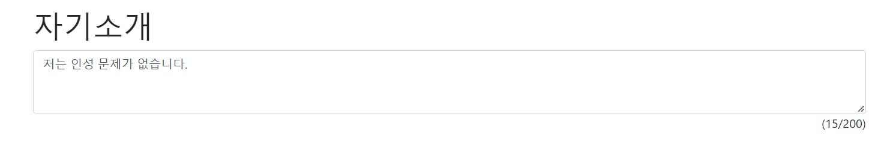

# 자소서 글자수 계산기-jvs
    

위의 사진과 같이 자바스크립트로 자기소개 글자수 계산하는 것을 만들어 보겠다.   

먼저, 기본 코드를 밑에 처럼 작성해주고, body 부분에 코드를 입력한다.

```html
<!DOCTYPE html>
<html lang="ko">
<head>
    <meta charset="UTF-8">
    <meta name="viewport" content="width=device-width, initial-scale=1.0">
    <title>자소서 글자수 계산기</title>
    <link rel="stylesheet" href="https://stackpath.bootstrapcdn.com/bootstrap/4.5.2/css/bootstrap.min.css" integrity="sha384-JcKb8q3iqJ61gNV9KGb8thSsNjpSL0n8PARn9HuZOnIxN0hoP+VmmDGMN5t9UJ0Z" crossorigin="anonymous">
    <style>
        h1 {
            margin-top: 30px;
        }
        #count {
            float: right;
        }
    </style>
    </head>
    <body>
        
    </body>
    </html>

```   
body 부분에 "container" class를 만들고, 자기소개를 입력하여 위 사진과 같이 텍스트 보이게 해주었다. 그리고 script를 사용하기 위해 입력해 주었다.

```html
<body class="container">
        <h1>자기소개</h1>
        <script>
        
        </script>
    </body>
```   
funciton은 함수를 말하는 것인데, 명령 모음을 의미한다.  
counter함수이름을 설정하여 함수를 만들어 주었다.    
counter함수는 글자수를 세기위한 코드를 함수로 만들어주었다.   
그리고, jasoseol이라는 id를 가진 태그의 값을 가져오는 코드를 ```document.getElementById('jasoseal').value;``` 를 써주고 었고, 
글자수를 세기 위한 count라는 id를 가진 태그의 값을 가져오는 코드를 써주고 ```.innerHTML = ""``` 을 써서 화면에 출력하였다.    
.length는 문자열의 길이를 받는 것으로 200까지 해주었다.    
그리고 마지막으로 ```counter()``` 써서 함수를 써주었다.

```html
<body class="container">
        <h1>자기소개</h1>
        <script>
            function counter(){
                //jasoseol이라는 id를 가진 태그의 값을 가져오는 코드
            var content = document.getElementById('jasoseol').value;
                //(,200) 200까지의 숫자 텍스트를 입력표시
            document.getElementById('count').innerHTML = '(' +content.length+'/200)';
            };
            counter();
        </script>
    </body>
```   
그렇다면, 200자 넘으면 더이상 안써지도록 하려면 어떻게 해야할까?   
바로 if문을 써서 조건문을 작성하고 .substring()를 써서 글자 수까지 자른다.   
예를 들어, 밑에처럼 썼다면 어떤 결과가 나올까?
```javascript
content = '인성 문제 없습니다.';
content.substring(0,5);
```   

바로, '인성 문제'로 결과가 나온다. 왜냐하면 0이상 5미만으로 글자수를 자르라는 소리이다. 즉, index는 0부터 시작하므로 '인성 문제'까지 결과가 나온다.   
따라서 200자 넘으면 더이상 안써지도록 하려면 어떻게 해야할까?   
```javascript
if (content.length > 200) {
                content = content.substring(0,200);
                document.getElementById('jasoseol').value = content;
            }
```    
를 써서, 안써지도록 할 수 있다.   
body부분 총 코드는, 
```javascript
<body class="container">
        <h1>자기소개</h1>
        <textarea onkeydown='counter();'class="form-control" rows="3" id="jasoseol">저는 인성 문제가 없습니다.</textarea>
        <span id="count">(0/200)</span>
        <script>
            function counter(){
                //jasoseol이라는 id를 가진 태그의 값을 가져오는 코드
            var content = document.getElementById('jasoseol').value;
            if (content.length > 200) {
                content = content.substring(0,200);
                document.getElementById('jasoseol').value = content;
            }
            document.getElementById('count').innerHTML = '(' +content.length+'/200)';
            };
            counter();
        </script>
    </body>

```   
이로써 자소서 글자수 계산기를 자바스크립트로 배워 보았다.